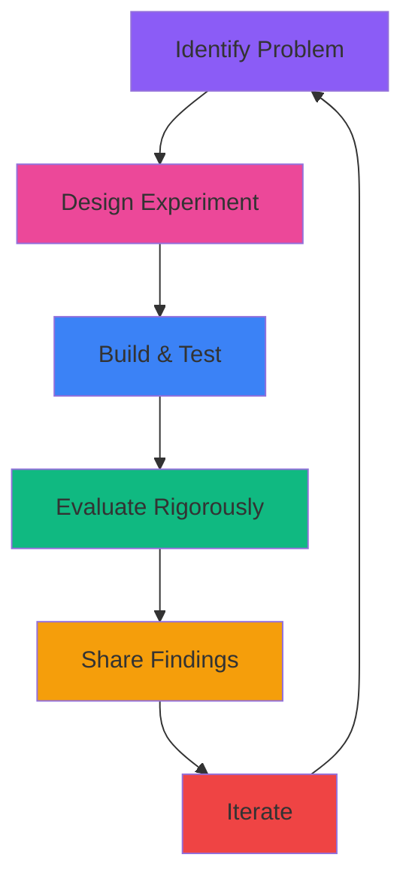

# 👋 Hey, I'm Faizan Abbas

<div align="center">
  
### AI Engineer | MSc AI Student | Research Enthusiast

[](https://git.io/typing-svg)

</div>

---

## About Me

Currently pursuing an **MSc in Artificial Intelligence** at the University of Aberdeen while working as an **Agentic AI Intern** at the Net Zero Technology Centre, where I'm building multi-agent systems to accelerate the green transition. My passion lies at the intersection of AI research, privacy-preserving ML, and making AI accessible and impactful.

```python
class AIEngineer:
    def __init__(self):
        self.name = "Faizan Abbas"
        self.location = "Aberdeen, UK 🏴󐁧󐁢󐁳󐁣󐁴󐁿"
        self.education = "MSc AI @ University of Aberdeen"
        self.degree = "First-Class Honours in Computing Science"
        
    def current_focus(self):
        return [
            "Multi-agent AI systems & knowledge graphs",
            "Privacy-preserving machine learning",
            "LLM evaluation & bias detection",
            "AI for energy transition & sustainability"
        ]
    
    def research_interests(self):
        return [
            "Membership inference attacks & differential privacy",
            "Cross-lingual bias in LLMs",
            "Agentic AI & RAG pipelines",
            "Mechanistic interpretability"
        ]
    
    def fun_fact(self):
        return "I've delivered AI workshops, taught 200+ students, and trained staff in Uganda 🌍"
```

## Research & Work

**Current Roles:**
- **Agentic AI Intern** @ Net Zero Technology Centre - Building multi-agent systems, knowledge graphs, and AI-powered decarbonisation tools
- **Research Intern** @ University of Aberdeen - Conducting qualitative research on work-based learning methodologies
- **MSc AI Student** - Diving deep into ML, NLP, agents, and knowledge representation

**Recent Highlights:**
- Presented at **Startup Grind Scotland** and CodeTheCity on AI agents powering green transition
- Submitted academic paper on **cross-lingual bias detection** in LLMs to Apart Research
- Participated in **Martian Mechanistic Router Interpretability Hackathon**
- Completed honours dissertation on **Privacy Leakage in Machine Learning** with membership inference attacks

## Tech Arsenal

<div align="center">

### Core Languages


### AI/ML & Deep Learning


### LLMs & Agentic AI


### Data Science & Visualization


### Development Tools


</div>

<!-- ## GitHub Analytics

<div align="center">
  


</div> -->

## Featured Projects

### Privacy Leakage in Machine Learning
Undergraduate honours dissertation investigating membership inference attacks on CNNs
- Built shadow models in PyTorch to assess privacy vulnerabilities
- Developed XGBoost-based attack achieving high accuracy with limited data
- Implemented differential privacy and regularisation as mitigation strategies
- Evaluated using AUC, TPR, and FPR metrics

### Cross-Lingual Bias Detection in LLMs
Apart x Martian Hackathon | Academic paper submitted
- Created judge-based evaluation framework for detecting language-dependent biases
- Tested across English, Chinese, Romanian, and Vietnamese (XQuAD dataset)
- Implemented 4-point scale evaluation system for correctness and reasoning quality

### Multi-Agent AI System (Net Zero Tech Centre)
Production system for knowledge management
- Built multi-agent system with RAG pipelines for automated file handling
- Designed knowledge graph connecting internal assets with technology databases
- Delivered AI awareness workshops and identified adoption opportunities

### Multi-Robot Fossil Exploration
Robotics simulation using ROS2 Jazzy Jalisco
- Designed autonomous multi-robot system with occupancy grid mapping
- Implemented probabilistic fossil detection and sensor management
- Developed distributed communication and battery optimization strategies

### Informed Agriculture Decision Making
NASA Space Apps Challenge
- Built rainfall prediction tool using NASA Earth observation data
- Created map-based interface with color-coded forecasts
- Processed NASA datasets with Python and JavaScript backends

### BERT vs. RoBERTa for Semantic Textual Similarity
NLP research comparing transformer models
- Analyzed performance on multilingual sentence pairs (EN, ES, DE, FR)
- Evaluated using Pearson correlation with human-annotated scores
- Investigated impact of model size on contextual representation

## Research Philosophy



## 🎓 Academic Journey

**MSc Artificial Intelligence** - University of Aberdeen (2025-Present)
- Machine Learning, Symbolic AI, Knowledge Representation
- Software Agents & Multi-Agent Systems, Data Mining with Deep Learning
- Natural Language Generation, Evaluation of AI Systems

**BSc Computing Science** - University of Aberdeen (First-Class Honours, 2025)
- Dissertation: Privacy Leakage in Machine Learning
- Global Student Ambassador | Student Representative | Student Support Worker | Student Focus Group Member
- Teaching Assistant for 200+ students across 5 courses

## Impact Beyond Code

- **Public Speaking**: Presented at Startup Grind Scotland on AI agents for green transition
- **Teaching**: Delivered 43 ICT training sessions in Uganda, supporting digital transformation
- **Podcast Host**: Disseminating research findings on work-based learning methodologies
- **Sustainability**: Building AI tools for decarbonisation and energy transition
- **Global Citizen**: Worked in Uganda, studied in Scotland, representing international perspectives

## Let's Connect

<div align="center">

[](https://www.linkedin.com/in/faizan-abbas-b774a2217)
[](mailto:faizankhuwaja5@gmail.com)
<!-- [](https://yourwebsite.com) -->
<!-- [](https://scholar.google.com/yourprofile) -->

</div>

---

<div align="center">

### Currently Exploring

**Multi-Agent Systems** • **Privacy-Preserving ML** • **LLM Evaluation** • **Knowledge Graphs** • **AI for Sustainability**
<!-- 
### 📈 Profile Views
 -->

*"The best way to predict the future is to invent it."* – Alan Kay

</div>

---

<div align="center">
  
</div>
